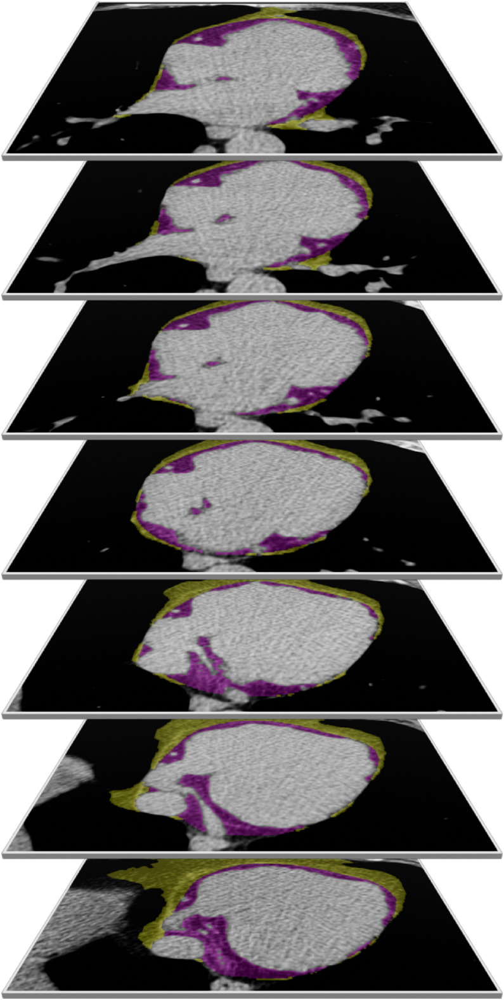

<!-- output: -->
<!--   bookdown::pdf_document2: -->
<!--     toc: false -->
<!--     number_sections: true -->
<!--     latex_engine: xelatex -->
```{r setup, include=FALSE, cache = FALSE}
knitr::opts_chunk$set(echo = FALSE, cache = FALSE)

#libraries
#requires packages officedown and rvg to compile tables into word file
library(rethinking)
library(tidyverse)
library(splines)
library(dagitty)
library(officedown)#to save as word file with refs
library(officer)#to save word tables
library(flextable)
library(patchwork)
library(cowplot)

#plotting parameters
malecol <- "turquoise4"
femalecol <- "darkorange"
allcol <- "purple4"
directcol <- "skyblue2"
totalcol <- "blue4"
partialcol1 <- "cornflowerblue"
partialcol2 <- "dodgerblue3"
cols <- c(femalecol, malecol)
seqalong <- seq(-4,4, length.out = 100)
xlim <- c(-2, 2)
ylim <- c(-1, 1)
mar <- c(4, 3, 0.5, 0.5)
age_mean <- 56.24951
counterfactual_age <- age_mean
dpi_val <- 300
pointsizeval <- 10


source("0_functions.R")
#if testing the following code only
source("1_bis_simulate_data_to_test_code.R")
#if original data are available
#source("1_data_process.R")
#to use simulated data
data_to_use <- dat_sim
#to use real data (if available)
#data_to_use <- all_dat


```

```{r prep_envir, cache=TRUE, include=FALSE}
source("2_analysis.R")

#Prep age for counterfactual construction
age_mean <- 56
age_SD <- 10
if(exists(data_expand)){
  age_mean <- mean(data_expand$age)
  age_SD <- sd(data_expand$age)
}

counterfactual_age_zscore <- (counterfactual_age - age_mean) / age_SD

#extract samples
post_nosex <- lapply(fits_nosex, extract.samples)
post_c <- lapply(fits_c, extract.samples)


post_noimput <- extract.samples(fits_noimput)
post_nosex_i <- lapply(fits_nosex_i, extract.samples)
post_2 <- extract.samples(fits_2a)
post_2a_i <- lapply(fits_2a_i, extract.samples)
post_2b <- extract.samples(fits_2b)
post_3 <- extract.samples(fits_3)
# post_4p <- lapply(fits_4_pz, extract.samples)
# post_4nb <- lapply(fits_4_nbz, extract.samples)
post_4pln <- lapply(fits_4_pzln, extract.samples)
post_4pln_i <- lapply(fits_4_pzln_i, extract.samples)
post_5 <- lapply(fits_5, extract.samples)
post_6 <- lapply(fits_6, extract.samples)


```

# Materials and Methods

## Study population and participants

Between July 2014 and September 2015, men and women aged 40+ years from 59 Tsimane villages were invited to participate in the CT scanning project. Younger adults (<40 years old) were excluded because CT scans were performed as part of a broader project on arteriosclerosis, which is negligible at younger ages for physically active adults. At the time, there were 1,214 eligible adults living in these villages (the only eligibility criteria were being 40+ years old, self-identifying as Tsimane, and willing to participate). A total of 731 adults were present in their villages at the time and subsequently received a CT scan.
Transporting participants from their village to the nearby market town of San Borja was logistically complicated (requiring trekking through the forest, dug-out canoes, rafts propelled by poles pushed off the river bottom, trucks, and cars) and can require up to two days of travel each way. From San Borja to the Beni department capital of Trinidad (where the hospital containing the CT scanner is located) is an additional six-hour car ride. Due to these logistical complications, potential participants who were not in their village at the time we arrived were not sampled. The Tsimane are semi-mobile and often build secondary houses deep in the forest near their horticultural plots, not returning to their village for extended periods of time. Hunting and fishing trips can last days or weeks, and some men engage in wage labor in San Borja or elsewhere (e.g. rural cattle ranches). In an average village, approximately one-third of individuals are away hunting, fishing, working in their horticultural plots, or in San Borja at any given time. Additionally, a major flood in February 2014 resulted in mass migration from some villages and the creation of new villages that were not sampled as part of this study, further reducing the number of individuals that could be sampled.
To address potential sources of sample bias, analyses comparing Tsimane who received CTs and those who did not but who participated in the project’s medical exams in Tsimane villages were conducted. There were no significant differences in sex, blood pressure, or body fat and the CT sample analyzed here is thought to be representative of all Tsimane aged 40+ years.
Of the 731 Tsimane who received a CT scan, data from 507 (69%) were selected with no particular criteria to estimate thoracic vertebral body BMD. Radiologist time constraints precluded analysis of all 731 adults.

## Computed tomography (CT) assessment of bone mineral density, arterial calcification and thoracic fat volume

CT-measured vertebral BMD is increasingly used for osteoporosis screening because of its ability to provide three-dimensional information compared to traditional dual x-ray absorptiometry two-dimensional images. The left main coronary artery (LMCA) was set as the reference site to allow reproducible detection of a spinal level for use with cardiac CT scanning. The LMCA is covered in 100% of images and the field of view can be completely reconstructed. Therefore, it is an optimal reference point to locate the starting measurement level. The most common location of the LMCA origin is at the lower edge of T7. Intra-observer variability in BMD measurements using the same measurement technique in a different sample was tested on 120 scans by one observer from the Los Angeles Biomedical Research Institute, with one week intervals between the two readings. To measure inter-observer variability on 67 randomly selected scans, the results obtained by two radiologists from the Los Angeles Biomedical Research Institute who were blinded to all clinical information and prior measurements were compared using this other sample. Intra- and inter-observer variations in BMD measurements were 2.5% (Bland-Altman plot ratio: 1.00, 95% CI: 0.99–1.00) and 2.6% (Bland-Altman plot ratio: 1.00, 95% CI: 0.99–1.00), respectively.
Typical multi-detector CT protocols used for evaluation of arterial calcification include imaging the chest in the reconstructed field of view, facilitating simultaneous evaluation of arterial calcium (measured here in the coronary arteries and thoracic aorta) and thoracic vertebral architecture (measured here via BMD) during a single examination without additional radiation exposure. The technician acquired a scan on each individual consisting of 30-40 2.5 mm slices ranging from the aortic arch to the diaphragm. Fields of view of 25 cm and 50 cm were used to image the entire heart and the ascending and descending aorta.
A threshold of 130 Hounsfield Units (HU) was used as the threshold for detecting CAC. Regarding calcium scoring, a sub-sample of 100 scans were scored twice to assess intra-observer variability, which was low. The mean variance between the two scores was 1.4 Agatston Units (AU). Two patients changed categories: one from 0 to >0 and one from <100 to > 100 AU. Coefficients of variation for scan reads were 5.4%.
Figure S\@ref(fig:CTs) below shows how thoracic fat volume was measured from the chest CTs.


```{r CTs, echo=FALSE, fig.cap="Axial view CT scan through the heart showing shading of epicardial fat (purple) and directly adjacent fat (gold) in a subject using QFAT software for quantification of thoracic fat volume (reproduced from: https://pubmed.ncbi.nlm.nih.gov/40918927/).", fig.height=4, fig.width=2}
 #, out.width="50%"
```


## Inflammatory biomarkers

Cytokine values below the limit of detection were replaced by the mid-point between the lower limit and zero. The small number of samples with concentrations above the limit of detection (<1%) were replaced with the highest detected value.


## Inferential approach: the DAG
We use directed acyclic graphs (DAGs) to clarify the assumptions underlying our statistical approach and to identify appropriate adjustment sets. We articulate the inferential goals into several exposure–outcome relationships, that are estimated independently, and clearly define separate estimands for each relationship (such as direct vs. total effects).  


```{r dag}
DAG <- dagitty('
dag {
  Age [adjusted,pos="-2,0"]
  BMD [outcome,pos="-0.5,-0.5"]
  Calcification [adjusted,pos="1,0"]
  Diet [latent,pos="-1.5,1"]
  Fat_free_mass [pos="-2,0.5"]
  Inflammation [adjusted,pos="1,0.5"]
  Sex [exposure,pos="0.5,1"]
  Thoracic_fat [adjusted,pos="-0.5,1.2"]
  Age -> BMD
  Age -> Calcification
  Age -> Fat_free_mass
  Age -> Inflammation
  Age -> Thoracic_fat
  Calcification -> BMD 
  Diet -> Fat_free_mass
  Diet -> Thoracic_fat
  Fat_free_mass -> BMD
  Inflammation -> BMD 
  Inflammation -> Calcification
  Sex -> BMD
  Sex -> Fat_free_mass
  Thoracic_fat -> BMD
  Thoracic_fat -> Calcification
  Thoracic_fat -> Inflammation
}
')
plot(DAG)

```

## Data Analysis

*Three outcomes with several specifications:* The DAG presented above helps us define the various estimands based on causal queries of interest, and corresponding model specifications. In line with our three study goals, we are estimating the direct, total, and partial effects of arterial calcification, inflammation, and thoracic fat on bone mineral density (BMD; goal 1). We are also estimating effects of inflammation and thoracic fat on arterial calcification (goal 2), and effects of thoracic fat on inflammation (goal 3). To do so, we specify multiple models, listed in Table S\@ref(tab:tablemodels). Below, we provide details for each model.

```{r tablemodelsold, tab.id = "tablemodels", tab.cap="List of model specifications and relative estimands (models 1, 2a, 2b, 3 and 6 are Gaussian linear regressions, models 4 and 5 are zero-inflated Poisson models).", eval=TRUE}

tab_models <- tibble::tribble(
  ~Model, ~Outcome, ~Calcification, ~Inflammation, ~Age, ~FFM, ~ThoracicFat, ~Estimands,

  "1", "BMD", "✓", "✓", "✓", "✓", "✓",
  "Direct effect of calcification; \n direct effect of inflammation;\n direct effect of thoracic fat",

  "2a", "BMD",  "", "✓", "✓", "✓", "✓",
  "Total effect of inflammation;\n indirect effect of thoracic fat \n(through calcification)",

  "2b", "BMD",  "✓", "", "✓", "✓", "✓",
  "Indirect effect of thoracic fat \n(through inflammation)",

  "3", "BMD", "", "", "✓", "✓", "✓",
  "Total effect of thoracic fat",

  "4", "Calcification",  "", "✓", "✓", "✓", "✓",
  "Direct effect of inflammation;\n direct effect of thoracic fat",

  "5", "Calcification",  "", "", "✓", "✓", "✓",
  "Total effect of thoracic fat",

  "6", "Inflammation",  "", "", "✓", "✓", "✓",
  "Direct effect of thoracic fat"
)

ft <- flextable(tab_models)

ft <- ft |>
  autofit() |>
  theme_booktabs() |>
  align(j = 1:7, align = "center", part = "all") |>
  align(j = 8, align = "left", part = "all") |>
  valign(valign = "top") |>
  set_header_labels(
    Model = "Model",
    Outcome = "Outcome",
    #AnyCalc = "Any calcification",
    Calc = "Calcification",
    Inflam = "Inflammation",
    Age = "Age",
    FFM = "Fat-free \n mass",
    ThoracicFat = "Thoracic fat",
    Estimands = "Estimands"
  )

ft
```


### Bone Mineral Density as outcome

*Estimands:* Model 1 permits estimation of the direct effects of all variables of interest (arterial calcification, inflammation, and thoracic fat), plus the covariates age and fat-free mass. By removing the arterial calcification parameters, in model 2a, we estimate both the total effect of inflammation and the indirect effect of thoracic fat passing through arterial calcification. Similarly, in model 2b we estimate the indirect effect of thoracic fat passing through inflammation, by removing inflammation from the full control set. Model 3, which does not include either arterial calcification or inflammation, permits estimation of the total effect of thoracic fat on BMD.


*Model specification(s):*
BMD is modeled as a normally distributed quantity, with mean determined by a combination of the variables of interest. The specification for the full model (model 1) is shown below:
$$
\begin{align}
BMD_i &\sim \text{Normal}(\mu_i,\sigma) \\
\mu_i &=
\alpha_{s_i}
+\beta_{1,s_i}\,\text{Any Calc}_i
+\beta_{2,s_i}\,\text{Calc}_i
+\gamma_{s_i}\,\text{Age}_{i}
+\epsilon\,\text{FFM}_{i}
+\eta\,\text{Thoracic Fat}_{i}
+\theta\,\text{Inflam}_{i}
\end{align}
$$

Alternative specifications remove both parameterizations relative to calcification (parameters $\beta_1$ and $\beta_2$, respectively signifying arterial calcification presence or absence, and calcification amount (in Agatston Units), model 2a), the parameter for inflammation $\theta$ (model 2b) and both sets of parameters (model 3, which includes only age, fat-free mass and thoracic fat as predictors). 

*Priors:* For all models we employ weakly regularizing priors:
$$
\begin{align}
\alpha,\beta,\gamma,
\epsilon,\eta,\theta
&\sim \text{Normal}(0,1)\\
\sigma &\sim \text{Exponential}(1)
\end{align}
$$


#### Sex differences 
Sex enters the DAG by affecting fat-free mass and BMD directly. However, this does not clarify how sex should be included in the model, as sex may interact with the other variables to determine BMD, and interactions are not specifically represented in the DAG. We model sex by allowing it to vary how age impacts BMD, as the female skeleton is expected to show an accelerated decline in BMD associated with the transition to menopause. We are also interested in estimating the extent to which sex moderates the effect of arterial calcification on BMD. Hence, we allow both γ and the two β parameters to vary between sexes. Additionally, we allow the intercept α to vary between sexes, so that the model can produce different expected values for the average female and average male.
We run most models with both specifications: looking both at the unified patterns across sexes and at the differences between sexes. For parameters that do not vary across sexes (θ for inflammation, η for fat-free mass, etc.), we always consider models where the sexes are combined to produce a single estimate, whereas we consider results that both include and exclude sex differences when making inferences about effects of arterial calcification or age on BMD.
<!-- $\gamma$ and the two $\beta$ parameters to vary between sexes. Additionally, we allow the intercept $\alpha$ ($\theta$ for inflammation, $\eta$  -->

#### Calcification presence and amount are modelled separately {#betas}
<!-- `r 100*round(1-sum(dat$any_calc)/dat$N, 2)`\%  -->
Because different processes may lead to the initial onset of arterial calcification compared to calcification progression, we model separately the effect of having any calcification vs. the effect of subsequent increases in the amount of calcification (what we call “severity” throughout the paper). $\text{Any Calc}_i$_i is a binary indicator taking value 1 when any calcification is present and 0 otherwise (the value becomes 1 if any of the three calcification markers are present when markers are considered together, see section \@ref(composite)). In addition, $\text{Calc}_i$ represents calcification severity. Consequently, $\beta_1$ estimates the discontinuous change in BMD associated with calcification presence, while $\beta_2$ estimates the slope relating BMD to calcification severity among individuals with calcification.

Figures representing predicted changes in BMD by varying amounts of calcification, such as Figure 2 (main text), represent both expected BMD of an individual with no calcification (on the left side of the figure, mean and 89% PI of the posterior distribution) and expected change in BMD with increasing calcification severity, as a counterfactual curve on the right.

#### Composite calcification and inflammation parameters {#composite}
Our measures of arterial calcification are based on three vascular beds: the coronary arteries, the ascending and descending thoracic aorta (excluding the thoracic aortic arch), and the thoracic aortic arch. Measures of inflammation are based on four serum biomarkers: CRP, IL-1β, IL-6, and TNF-α. We are interested in examining both individual vascular beds and inflammatory biomarkers, as well as overall measures of arterial calcification and inflammation. Composite measures may better capture more general patterns of arterial calcification and inflammation, whereas analyses of individual vascular beds and biomarkers may reveal heterogeneity in local associations. In order to combine the information provided by the different vascular beds and inflammatory biomarkers, we construct a composite measure of both arterial calcification and inflammation within the statistical model, jointly with the regression on BMD. This means that the model learns the combination of markers that is most predictive of variation in BMD conditional on the other covariates. As a consequence, the composites are outcome-oriented rather than purely descriptive of the covariance structure, and approximate the more general arterial calcification and inflammation burden. Figure S\@ref(fig:compositesdatapoints) shows the estimated composite values for arterial calcification and inflammation for all individuals in our sample and the estimated change in BMD with varying levels of the composites. 

```{r compositesdatapoints, fig.cap= "Estimated composite values for arterial calcification (A) and inflammation (B). Mean and 89% PI of posterior estimates of an individual’s composites are shown by points and lines, color coded by sex (N = 453). The values of the points on the y axis correspond to observed BMD. They are superimposed to the counterfactual prediction curves showing estimated change in BMD with varying levels of the composite score, where the line represents the mean and the shaded area the 89% PI of the posterior distribution for the slope.",  fig.height=3, fig.fullwidth=TRUE, warning=FALSE, dpi = dpi_val, dev.args = list(pointsize = pointsizeval)}
par(mfrow = c(1,2),mgp = c(1.5, 0.5, 0), mar = c(2.5, 2.2, 2, 1) + 0.1)
covariates <- list(calc = c(0, 0, 0),
                   age = counterfactual_age_zscore,
                   ffm = 0,
                   thoracic_fat = 0,
                   inflam = c(0,0,0,0),
                   calc_composite = TRUE)

plot_counterfactual_sex(
  post = post_c[["all"]],
  vary = "calc",
  vary_seq = seq(0,4, length.out = 100),
  covariates = covariates,
  xlab = "Calcification composite",
  xlim = c(0,3.5),
  ylim = c(-2.5,3),
  latent_points = TRUE,
  latent_var = "calc",
  dat = dat
)
mtext("A", side = 3, line = 0, at = 0 )
legend_ribbon(x0 = 2, y0 = 2.5,
  label = "Women", col = femalecol)
legend_ribbon(x0 = 2, y0 = 2,
  label = "Men", col = malecol)

covariates <- list(calc = c(0, 0, 0),
                   age = counterfactual_age_zscore,
                   ffm = 0,
                   thoracic_fat = 0,
                   inflam = c(0,0,0,0),
                   inflam_composite = TRUE)

plot_counterfactual_sex(
  post = post_c[["all"]],
  vary = "inflam",
  vary_seq = seqalong,
  covariates = covariates,
  xlab = "Inflammation composite",
  xlim = c(-2,3),
  ylim = c(-2.5,3),
  latent_points = TRUE,
  latent_var = "inflam",
  dat = dat
)
mtext("B", side = 3, line = 0, at = -2 )

```

Note that composite scores correlate strongly with all arterial calcification markers (left column in Figure S\@ref(fig:covairancecalc) below).

```{r covairancecalc, fig.cap= "Covariance between arterial calcification measures (from the coronary arteries (CAC), the ascending and descending thoracic aorta (excluding the thoracic aortic arch; TAC), and the aortic arch; AAC) and the calcification composite score (N = 453).", warning=FALSE, dpi = dpi_val, dev.args = list(pointsize = pointsizeval)}
calc_comp <- colMeans(post_c[[1]]$calc)

pairs(
  cbind(calc_comp, dat$calc_markers[,1:3]),
  labels = c("composite","CAC","TAC","AAC"),
  lower.panel = panel.cor,
  upper.panel = panel.smooth,
  pch = 16, col = adjustcolor(partialcol2, 0.4)
)
#to check mean cac and tac for individuals who have high aac value
# high_aac <- dat$calc_markers[,3] > log10(100)
# 
# colMeans(dat$calc_markers[high_aac,], na.rm=TRUE)

```


```{r inflam_markers_collinearity, fig.cap= "Covariance between inflammatory biomarkers and the inflammation composite score (N = 340; complete cases only).", warning=FALSE, dpi = dpi_val, dev.args = list(pointsize = pointsizeval)}
inflam_comp <- colMeans(post_noimput$inflam)

pairs(
  cbind(inflam_comp, dat_noimput$inflam_markers[,1:4]),
  labels = c("composite","CRP","IL1β","IL6","TNFα"),
  lower.panel = panel.cor,
  upper.panel = panel.smooth,
  pch = 16, col = adjustcolor(partialcol2, 0.4)
)
```

The composite measures are built multiplying the markers' values by weights, which are drawn from a simplex distribution. The composite values $\text{Calc}_i$ and $\text{Inflam}_i$ are estimated from the sum of the product of each arterial calcification marker $m$ (or inflammation marker $k$) by the weights $\xi$ and $\zeta$,as follows:

$$
\begin{align}
Calc_i &= \sum_{m=1}^{M} \xi_m \, Calcification\, Marker_{im}\\
Inflam_i &= \sum_{k=1}^{I} \zeta_k \, Inflammation\, Marker_{ik}
\end{align}
$$


Note that the weights $\xi$ and $\zeta$ are drawn from Dirichelet distributions, which makes them simplexes, i.e. they have to sum to one.

$$
\begin{align}
\zeta &\sim \mathrm{Dirichlet}(1,\ldots,1)\\ 
\xi &\sim \mathrm{Dirichlet}(1,\ldots,1)
\end{align}
$$

The model effectively performs a supervised dimensional reduction: markers receiving larger weights are those contributing more strongly to the prediction of BMD.
Because the markers are standardized prior to analysis, the simplex weights can be interpreted as the relative contribution of each marker to the predictive composite. Figure S \@ref(fig:weights) shows the posterior estimates for $\xi$ and $\zeta$ for each marker.

```{r weights, eval=TRUE, fig.cap= "Simplex weights that represent the relative contribution of each marker to the predictive composite, for arterial calcification (A), and inflammation (B). Shown are means and 89% PI intervals of posterior coefficient estimates from model 1 in Table S44 (N = 453).",  fig.height=3, fig.fullwidth=TRUE, dpi = dpi_val, dev.args = list(pointsize = pointsizeval)}

par(mfrow = c(1,2),mgp = c(1.5, 0.5, 0), mar = c(2.5, 2.2, 2, 1) + 0.1)

inflam_names <- c("CRP", "IL1β", "IL6", "TNFα")
calc_names <- c("CAC","TAC","AAC")

plot(NULL, xlim = c(0,1), ylim = c(0.5, 3.5), xlab = "ξ (Calcification weights)", ylab = "", yaxt='n' )

for(i in 3:1){

  lines( PI(post_c[[1]]$xi[,i]), rep(i, 2), lwd = 3, col = directcol)
  points( mean(post_c[[1]]$xi[,i]), i , pch = 16, cex = 2, col = partialcol2 )
}
  axis(side = 2, at = 3:1, labels = calc_names, las = 2)
mtext("A", side = 3, line = 0, at = 0 )

plot(NULL, xlim = c(0,1), ylim = c(0.5, 4.5), xlab = "ζ (Inflammation weights)", ylab = "", yaxt='n' )

for(i in 4:1){

  lines( PI(post_c[[1]]$zeta[,i]), rep(i, 2), lwd = 3, , col = directcol)
  points( mean(post_c[[1]]$zeta[,i]), i , pch = 16, cex = 2, col = partialcol2  )
}
  axis(side = 2, at = 4:1, labels = inflam_names, las = 2)
mtext("B", side = 3, line = 0, at = 0 )


```

For all analyses where arterial calcification and inflammation are considered as covariates, we estimate the composite scores, effectively integrating information from all markers. When arterial calcification and inflammation are predictors, we provide results both from models that include the composite score, and from models that are fit using each marker separately, generating up to 3x4 sets of results.

When only one marker is included, the simplex reduces automatically to a weight of one, causing the composite to collapse to the observed variable itself. This allows the same model specification to flexibly accommodate both single-marker and multi-marker analyses.

Figures S\@ref(calcmarkers) and S\@ref(inflammarkers) compare how BMD is expected to vary with each arterial calcification and inflammation marker, respectively, according to a model that includes them all through the composite (left side), to a set of models that estimate the effect of one marker at a time (right side).

```{r calcmarkers, fig.cap = "Comparing counterfactual prediction curves for arterial calcification markers from a model that includes all markers (left panels, where they are computed as a proportion ξ of total effect β₂) vs. models estimating them one at a time (right panels, where the effect is determined by β₂ only, N = 453).",  fig.height=6, fig.fullwidth=TRUE, dpi = dpi_val, dev.args = list(pointsize = pointsizeval)}
#####################################################
#extract posterior samples from fit of four different models (all calcification, cac, tac, aac)

covariates <- list(calc = 0,
                   age = counterfactual_age_zscore,
                   ffm = 0,
                   thoracic_fat = 0,
                   inflam = c(0, 0, 0, 0))

# calcification variables
calc_vars <- c("cac", "tac", "aac")

#prepare plot layout
par(mfrow = c(length(calc_vars), 2), mgp = c(1.5, 0.5, 0), mar = c(2.5, 2.2, 2, 1) + 0.1
)
seqalong_c <- seq(0,4, length.out = 100)
for(v in calc_vars){
  
  idx <- match(v, calc_vars)
  covariates$calc <- c(0,0,0)
  plot_counterfactual_sex(
    post = post_c[["all"]],
    vary = "calc",
    vary_seq = lapply(seqalong_c, function(x){
      z <- c(0,0,0)
      z[idx] <- x / mean(post_c[["all"]]$xi[,idx])#vary the overall calcification composite through this biomarker
      z }),
    covariates = covariates,
    xlab = paste(v, "(log)"),
    xlim = c(0,3.5),
    main = paste(v, "- all markers")
  )
  points(dat$calc_markers[,idx], dat$bmd_z, col = adjustcolor(cols[dat$sex], 0.3), pch = 16)
  
  covariates$calc <- c(0)
  plot_counterfactual_sex(
    post = post_c[[v]],
    vary = "calc",
    vary_seq = seqalong_c,
    covariates = covariates,
    xlab = paste(v, "(log)"),
    xlim = c(0,3.5),
    main = paste(v, "- single marker")
  )
  points(dat$calc_markers[,idx], dat$bmd_z, col = adjustcolor(cols[dat$sex], 0.3), pch = 16)
}
```


```{r inflammarkers, fig.cap = "Comparing counterfactual prediction curves for inflammation biomarkers from a model that includes all biomarkers (left panels, where they are computed as a proportion ζ of total effect θ) vs. models estimating them one at a time (right panels, where the effect is determined by θ onl, N = 340; complete cases only).", fig.height=8, fig.fullwidth=TRUE, dpi = dpi_val, dev.args = list(pointsize = pointsizeval)}

###############################
# look at inflammation markers#
###############################
covariates <- list(calc = c(0, 0, 0),
                   age = counterfactual_age_zscore,
                   ffm = 0,
                   thoracic_fat = 0,
                   inflam = 0)
inflam_vars <- c("crp","il1b","il6","tnfa")
seqalong <- seq(-4,4, length.out = 100)

par(
  mfrow = c(length(inflam_vars), 2),mgp = c(1.5, 0.5, 0), mar = c(2.5, 2.2, 2, 1) + 0.1)


for(v in inflam_vars){
  
  idx <- match(v, inflam_vars)
  
  # FULL MODEL
  plot_counterfactual(
    post = post_nosex_i[["all"]],
    vary = "inflam",
    vary_seq = lapply(seqalong, function(x){
      z <- c(0,0,0,0)
      z[idx] <- x / mean(post_nosex_i[["all"]]$zeta[, idx])
      z
    }),
    covariates = covariates,
    xlab = paste(v, "(z-score)"),
    main = paste(v, "- all markers")
  )
    points(dat$inflam_markers[,idx], dat$bmd_z, col = adjustcolor(cols[dat$sex], 0.3), pch = 16)
    mtext(LETTERS[idx*2-1], side = 3, line = 0, at = -2 )

  # SINGLE MARKER MODEL
  plot_counterfactual(
    post = post_nosex_i[[v]],
    vary = "inflam",
    vary_seq = seqalong,
    covariates = covariates,
    xlab = paste(v, "(z-score)"),
    main = paste(v, "- single marker")
  )
    points(dat$inflam_markers[,idx], dat$bmd_z, col = adjustcolor(cols[dat$sex], 0.3), pch = 16)
    mtext(LETTERS[idx*2], side = 3, line = 0, at = -2 )
}


```


#### Imputing missing inflammation values

Some inflammatory biomarker data are missing due to budget constraints precluding analysis or insufficient sample volume. While CRP data are nearly complete (`r round(100 * (1 - (sum(is.na(data_expand$log_crp_mean_z))/507)))`% of entire BMD sample of 507 total adults), 138 individuals are missing at least one cytokine measure. Most individuals who are missing at least one cytokine measure are missing all three cytokines (IL-1β, IL-6 and TNF-α). 
For all individuals with missing biomarker information, missing values were treated as unknown parameters and estimated jointly with the model. Because all biomarkers were standardized prior to analysis, missing values were assigned weakly informative standard normal priors, which match the distribution of the available biomarker z-scores:

$$
\text{IL1B}_{i,\text{miss}}, \text{IL6}_{i,\text{miss}},\text{TNFA}_{i,\text{miss}} \sim \text{Normal}(0,1)
$$

In a few cases, where one of the three cytokines was available, this available marker was ignored and imputed as if missing, as code and computation would have required unreasonably higher effort for the additional precision gained.

The posterior for the missing values does not update meaningfully, as expected, and remains substantially close to a standard normal distribution.
Parameter posterior estimates change very little when imputing, but there are small gains in precision, see Figure S\@ref(fig:imputprecision). 

```{r imputprecision,  fig.cap = "Posterior estimates for main parameters estimated by imputing the missing values (N = 453) vs. the same model without imputation (N = 340).", fig.height=8, fig.fullwidth=TRUE, dpi = dpi_val, dev.args = list(pointsize = pointsizeval)}
#compare_param(post_c[["all"]], post_noimput, "epsilon", post1_label = "Imputed", post2_label = "Complete case")

par(mfrow = c(4,2),mgp = c(1.5, 0.5, 0), mar = c(2.5, 2.2, 2, 1) + 0.1)

compare_density(post_c[["all"]], post_noimput, "alpha")
mtext("A", side = 3, line = 0, at = -1 )
compare_density(post_c[["all"]], post_noimput, "beta1")
mtext("B", side = 3, line = 0, at = -1 )
compare_density(post_c[["all"]], post_noimput, "beta2")
mtext("C", side = 3, line = 0, at = -1 )
compare_density(post_c[["all"]], post_noimput, "gamma")
mtext("D", side = 3, line = 0, at = -1 )
compare_density(post_c[["all"]], post_noimput, "theta")
mtext("E", side = 3, line = 0, at = -1 )
compare_density(post_c[["all"]], post_noimput, "eta")
mtext("F", side = 3, line = 0, at = -1 )
compare_density(post_c[["all"]], post_noimput, "epsilon")
mtext("G", side = 3, line = 0, at = -1 )
compare_density(post_c[["all"]], post_noimput, "sigma")
mtext("H", side = 3, line = 0, at = -1 )

```

All in all, the parametric imputation of the missing values allows the model to use more data for the estimates where the data can provide information (i.e. where data are not missing), without making assumptions about the actual value of the missing data, which are treated as parameters from the same distribution as the available data. 


### Calcification as outcome

*Estimands:* Model 4 (table S\@ref(tab:tablemodels)) permits estimation of the direct effects of inflammation and thoracic fat, plus the covariates age and fat-free mass. By removing the inflammation parameters, in model 5, we can estimate the total effect of thoracic fat.


*Model specification(s):*
In the following models, calcification is fit to a zero-inflated Poisson distribution. The zero-inflated component of the model accounts for the high proportion of zero values and estimates factors predicting arterial calcification presence separately from those predicting calcification severity. Moreover, such structure mirrors the two parameters used to estimate the role of calcification in BMD used in models 1 and 2b (table S\@ref(tab:tablemodels)), consistent with the idea that processes leading to arterial calcification onset may be different than those leading to increasing calcification severity. 

$$
\begin{align}
Y_i &\sim \text{Zero-Inflated Poisson}(\pi_i,\lambda_i)\\
P(Y_i=0) &= \pi_i + (1-\pi_i)e^{-\lambda_i}\\
P(Y_i=y) &= (1-\pi_i) \frac{\lambda_i^y e^{-\lambda_i}}{y!}\\
\qquad y&>0
\end{align}
$$
The model then estimates the probability that an individual's arterial calcification marker is equal to zero, $\pi$, and the mean of the Poisson distribution generating non-zero values, $\lambda$, separately. Each depends on a linear model, as shown below. 


$$
\begin{align}
\log(\lambda_i) &=
\alpha_{i}
+ \gamma_{i}\,\text{Age}_i
+ \epsilon\,\text{FFM}_i
+ \eta\,\text{ThoracicFat}_i
+ \theta\,\text{Inflam}_i 
+ \upsilon_i\\
\text{logit}(\pi_i) &=
\alpha^{(0)}_{i}
+ \gamma^{(0)}_{i}\,\text{Age}_i
+ \epsilon^{(0)}\,\text{FFM}_i
+ \eta^{(0)}\,\text{ThoracicFat}_i
+ \theta^{(0)}\,\text{Inflam}_i
\end{align}
$$
To estimate the total effect of thoracic fat on arterial calcification, we estimate model 5, which does not adjust for inflammation.

*Observation-level random effects:* Note that the linear model corresponding to $\lambda$ includes the parameter $\upsilon_i$. This observation-level random effect models residual variability not explained by the predictors of arterial calcification, thereby accommodating the substantial overdispersion and right skewness characteristic of calcification measures. 

Figure S\@ref(fig:poissonfit) shows posterior prediction checks for the zero-inflated Poisson model. Posterior predictive simulations reproduced both the observed proportion of zero values and the highly right-skewed distribution of arterial calcification scores, supporting the adequacy of the zero-inflated Poisson specification with observation-level random effects.

```{r poissonfit, fig.id="poissonfit", fig.cap= "Posterior prediction checks from the zero-inflated Poisson model with observation-level random effects (N = 453).", fig.height=6, fig.width=7, dpi = dpi_val, dev.args = list(pointsize = pointsizeval)}
par(mfrow = c(3, 3))

for(j in 1:3){
  
  yrep <- ppd_calc_zipln(
    post = post_4pln[[j]],
    dat = dat
  )
  
  plot_ppc_distribution(
    y = dat_raw$calc_markers[,j],
    yrep = yrep
  )
  
  title(colnames(dat_raw$calc_markers)[j])  
  
  ppc_zeros(
    y = dat_raw$calc_markers[,j],
    yrep = yrep
  )
  
  
  ppc_meanvar(
    y = dat_raw$calc_markers[,j],
    yrep = yrep
  )
  
}
```

*Priors:* All parameters are drawn from priors $\text{Normal} (0,1)$, except for the standard deviation of the pooled observation-level random effect $\upsilon$, which is drawn from a prior $\text{Half-Normal} (0,1)$ to limit overdispersion.
 
Note that Models 4 and 5 (Table S\@ref(tab:tablemodels)) are fit separately for each vascular bed. When adjusting for inflammation, a composite measure of inflammation was used. When inflammation was an exposure of interest, results are presented separately for each inflammatory biomarker.

### Inflammation as outcome

*Estimands:*
Model 6 (Table S\@ref(tab:tablemodels)) permits estimation of the direct effect of thoracic fat on inflammation.

*Model specification:*
Inflammation is modeled as a normally distributed variable with mean $\mu$, determined by the following linear model:
$$
\begin{align}
\text{Inflam}_{i} &\sim \text{Normal}(\mu_i,\sigma) \\
\mu_i &=
\alpha_{i}
+\gamma_{i}\,\text{Age}_{i}
+\epsilon\,\text{FFM}_{i}
+\eta\,\text{ThoracicFat}_{i}
\end{align}
$$

*Priors:* we employ the same weakly regularizing priors as in model 1. 


Note that Model 6 was run separately for each inflammatory biomarker as an outcome, and no composite inflammation measure was constructed.


# Additional Results

## Descriptive results

```{r corrs_tab, tab.id = "corrs_tab", tab.cap= "Inter-correlations among study variables (pooled across sexes; complete cases only). Inflammatory biomarkers (#’s 4-7 below) and arterial calcification indicators (#’s 8-10) are logged. Spearman correlations are shown for non-normally distributed variables (i.e., IL-1β, TNF-α, and arterial calcification indicators; otherwise Pearson correlations are shown)."}
vars <- c("age_z", "ffm_z", "thoracic_fat_z", "log_crp_mean_z", "log_il1b_cytokines_mean_z", "log_il6_cytokines_mean_z", "log_tnfa_cytokines_mean_z", "log_cac_z", "log_tac_z", "log_aortic_arch_ca_z", "bmd_z" )

labels <- c("Age", "FFM", "Thoracic fat", "CRP (log)", "IL-1β (log)", "IL-6 (log)", "TNF-α (log)", "CAC (log)", "TAC (log)", "AAC (log)", "BMD")

spearman_vars <- c("log_il1b_cytokines_mean_z", "log_tnfa_cytokines_mean_z", "log_cac_z", "log_tac_z", "log_aac_z")

# Empty matrix
nvar <- length(vars)
tab <- matrix("", nrow = nvar, ncol = nvar)

# Fill matrix
for(i in seq_len(nvar)){
  for(j in seq_len(nvar)){
    if(i == j){
      tab[i,j] <- "1"
    } else if(i > j){
      tab[i,j] <- sprintf(
        "%.2f",
        panel.cor(data_expand[[vars[i]]], data_expand[[vars[j]]], return_value = TRUE, 
                  method = ifelse(vars[i] %in% spearman_vars, "spearman", "pearson"))
      )
    } 
  }
}

# Convert to dataframe
tab_df <- as.data.frame(tab)
colnames(tab_df) <- paste0("(", seq_len(nvar), ")")
tab_df <- cbind(Variable = paste0("(", seq_len(nvar), ") ", labels ), tab_df )

# Flextable
ft <- flextable(tab_df)
ft <- autofit(ft)
ft <- set_caption(ft, caption = "Inter-correlations among study variables by sex.")
ft <- add_footer_lines(ft, values = "Abbreviations: FFM: Fat-free mass; CRP: high-sensitivity C-reactive protein; IL-1β: interleukin-1β; IL-6: interleukin-6; TNF-α: tumor necrosis factor-α; CAC: coronary artery calcium; TAC: thoracic aortic calcium (i.e. ascending and descending aorta, excluding the aortic arch); AAC: aortic arch calcium; BMD: bone mineral density.")

ft
```


```{r descriptivesbyage, fig.cap="Age-related change in arterial calcification indicators (A-C) and BMD (D) by sex. Locally estimated scatterplot smoothing (loess) is used to fit lines.", fig.height=4, fig.width=7, warning=FALSE, message=FALSE,  dpi = dpi_val, dev.args = list(pointsize = pointsizeval)}

#message = FALSE,
sexcolor <- c( male = malecol, female = femalecol)
data_expand$sex <- ifelse(data_expand$male == 1, "male", "female")
# Vascular calcification by age
# CAC
g <- ggplot(data_expand, aes(x = age, y = log_cac, color = sex)) +
  geom_point(size=1.2) +  
  scale_color_manual(values = sexcolor) +
geom_smooth(method = "loess", se = FALSE, linewidth = 1.2) +
  xlim(40, 85) +
  ylim(0, 4.5) +
  labs(
    x = "Age (years)", y = "CAC (log)", color = "Sex") +
  guides(color = guide_legend(override.aes = list(shape = 16, size = 2))) +
  theme_minimal() 
# TAC
h <- ggplot(data_expand, aes(x = age, y = log_tac, color = sex)) +
  geom_point(size=1.2) +   
  scale_color_manual(values = sexcolor) +
  geom_smooth(method = "loess", se = FALSE, linewidth = 1.2) +
  xlim(40, 85) +
  ylim(0, 4.5) +
  labs(
    x = "Age (years)", y = "TAC (log)", color = "Sex") +
  guides(color = guide_legend(override.aes = list(shape = 16, size = 2))) +
  theme_minimal() 

# AAC
i <- ggplot(data_expand, aes(x = age, y = log_aortic_arch_ca, color = sex)) +
  geom_point(size=1.2) +   
  scale_color_manual(values = sexcolor) +
  geom_smooth(method = "loess", se = FALSE, linewidth = 1.2) +
  xlim(40, 85) +
  ylim(0, 4.5) +
  labs(
    x = "Age (years)", y = "AAC (log)", color = "Sex") +
  guides(color = guide_legend(override.aes = list(shape = 16, size = 2))) +
  theme_minimal() 

# BMD by age
k <- ggplot(data_expand, aes(x = age, y = bmd, color = sex)) +
  geom_point(size=1.2) +  
  scale_color_manual(values = sexcolor) +
  geom_smooth(method = "loess", se = FALSE, linewidth = 1.2) +
  xlim(40, 85) +
  ylim(50, 350) +
  labs(
    x = "Age (years)",
    y = "BMD (mg/cm3)",
    color = "Sex"
  ) +
  guides(color = guide_legend(override.aes = list(shape = 16, size = 2))) +
  theme_minimal() 

g <- g + theme(legend.position = "none")
h <- h + theme(legend.position = "none")
i <- i + theme(legend.position = "none")
# Panel vascular calcification and BMD by age
panel_vasc_cal_age <- (g | h | i) / (k) +
  plot_layout(guides = "collect") +  # collect shared legend
  plot_annotation(tag_levels = list(c("A", "B", "C", "D")))+
  theme(legend.position = "right")  # place legend once, on the right

panel_vasc_cal_age
```


```{r corrs_sexes, tab.id = "corrs_sexes", tab.cap= "Inter-correlations among study variables by sex (complete cases only). Female values are below the diagonal and male values are above. Spearman correlations are shown for non-normally distributed variables (i.e., IL-1β, TNF-α, and arterial calcification indicators; otherwise Pearson correlations are shown)."}

# Split by sex
dat_f <- subset(data_expand, male == 0)
dat_m <- subset(data_expand, male == 1)

# Empty matrix
nvar <- length(vars)
tab <- matrix("", nrow = nvar, ncol = nvar)

# Fill matrix
for(i in seq_len(nvar)){
  for(j in seq_len(nvar)){
    if(i == j){
      tab[i,j] <- "1"
    } else if(i > j){
      # women below diagonal
      tab[i,j] <- sprintf(
        "%.2f",
        panel.cor(dat_f[[vars[i]]], dat_f[[vars[j]]], return_value = TRUE, 
                  method = ifelse(vars[i] %in% spearman_vars, "spearman", "pearson"))
      )
    } else {
      # men above diagonal
      tab[i,j] <- sprintf(
        "%.2f",
        panel.cor(dat_m[[vars[i]]], dat_m[[vars[j]]], return_value = TRUE, 
                  method = ifelse(vars[i] %in% spearman_vars, "spearman", "pearson"))
      )
    }
  }
}

# Convert to dataframe
tab_df <- as.data.frame(tab)
colnames(tab_df) <- paste0("(", seq_len(nvar), ")")
tab_df <- cbind(Variable = paste0("(", seq_len(nvar), ") ", labels ), tab_df )

# Flextable
ft <- flextable(tab_df)
ft <- autofit(ft)
ft <- set_caption(ft, caption = paste("Table S2. Inter-correlations among study variables by sex.", "Female values are below the diagonal and male values are above." ))
ft <- add_footer_lines(ft, values = "Abbreviations: FFM: Fat-free mass; CRP: high-sensitivity C-reactive protein; IL-1β: interleukin-1β; IL-6: interleukin-6; TNF-α: tumor necrosis factor-α; CAC: coronary artery calcium; TAC: thoracic aortic calcium (i.e. ascending and descending aorta, omitting the aortic arch); AAC: aortic arch calcium; BMD: bone mineral density.")


ft
```


## Bone mineral density is inversely associated with arterial calcification, particularly in the thoracic aortic arch

Table S\@ref(tab:coeffs) reports posterior estimates (89\% PI) for the coefficients of model 1, comparing models fit to differentiate between the sexes, or not. 

```{r coeffs, tab.id = "coeffs", tab.cap="Model 1 comparison, with and without sex differences (N = 453, including composite estimation for both arterial calcification and inflammation, and imputing missing inflammation). Note that sex 1 refers to females and sex 2 to males when the sexes are considered separately, while sex 1 refers to both sexes combined when all individuals are considered together. ", results='asis'}
pars <- c(
  "alpha",
  "beta1",
  "beta2",
  "gamma",
  "epsilon",
  "eta",
  "theta",
  "zeta",
  "xi"
)
tab <-
    extract_precis(
      fits_nosex[[1]],
      pars
    ) |>
    rename(!!"No sex" := estimate)

tmp <- 
    extract_precis(
      fits_c[[1]],
      pars
    ) |>
    rename(!!"Two sexes" := estimate)

tab <- full_join(tmp, tab, by = "parameter")
  

# convert dataframe to flextable
ft <- flextable(tab)

# create Word document
doc <- read_docx()

doc <- body_add_par(doc, "Posterior estimates for the full BMD model", style = "heading 1" )

doc <- body_add_flextable(doc, ft)

# save
print(doc, target = "outcomes/One_sex_vs_two_sexes_Posterior_estimates_BMD.docx" )

ft <- ft |>
  autofit() |>
  theme_booktabs() |>
  align(align = "center", part = "all") |>
  valign(valign = "top")

ft
# knitr::kable(
#   tab,
#   escape = FALSE,
#   caption =
#     "Model comparison of effects (model 1 with or without sex differences, N = 453, including composite estimation for both calcification and inflammation, and imputing missing inflammation). Note that sex 1 refers to females and sex 2 to males when the sexes are considered separately, while sex 1 refers to both sexes combined when all individuals are considered together.",
#   label = "coeffs"
# )
```

Table S\@ref(tab:coeffs_beds) also reports posterior estimates (89\% PI) for model 1 coefficients, comparing a model that differentiates between the sexes to a model that does not, but here the three vascular beds are considered separately. 
```{r coeffs_beds, tab.id = "coeffs_beds",tab.cap="Model 1 comparison by vascular bed, with and without sex differences (N = 453)."}
calc_vars <- c("cac", "tac", "aac")
pars <- c(
  "alpha",
  "beta1",
  "beta2",
  "gamma",
  "epsilon",
  "eta",
  "theta"
)
tab <- NULL

for (i in 2:4){
tmp1 <-
    extract_precis(fits_nosex[[i]], pars) |>
    rename(!!paste("No sex", calc_vars[i-1]) := estimate)

tmp2 <- extract_precis(fits_c[[i]], pars) |>
    rename(!!paste("Two sex", calc_vars[i-1]) := estimate)

if(is.null(tab)){
    tab <- full_join( tmp2, tmp1, by = "parameter")
  } else {
    tab <- full_join(tab, tmp2, by = "parameter")
    tab <- full_join(tab, tmp1, by = "parameter")
  }
}
ft <- flextable(tab)
ft <- ft |>
  theme_booktabs() |>
  align(align = "center", part = "all") |>
  valign(valign = "top")
ft <- set_table_properties(
  ft,
  layout = "autofit",
  width = 1
)
ft  
# knitr::kable(
#   tab,
#   escape = FALSE,
#   caption =
#     "Posterior estimates for the full BMD model"
# )
```


## Bone mineral density is inversely associated with inflammation
Figure S\@ref(fig:inflamMarkersDirectIndirectByMarker) shows expected BMD across varying values of each inflammatory biomarker.

```{r inflamMarkersDirectIndirectByMarker, fig.cap= "Expected BMD for varying levels of inflammatory biomarkers (model 1, each biomarker is considered separately, N = 340; complete cases only)", fig.height=6, fig.fullwidth=TRUE, dpi = dpi_val, dev.args = list(pointsize = pointsizeval)}
inflam_vars <- c("crp","il1b","il6","tnfa")
inflam_varsC <- c("CRP","IL-1β","IL-6","TNF-α")
seqalong <- seq(-4,4, length.out = 100)
covariates <- list(calc = c(0,0,0),
                   age = counterfactual_age_zscore,
                   ffm = 0,
                   thoracic_fat = 0,
                   inflam = 0)

par(
  mfrow = c(length(inflam_vars), 2),
  mar = c(3, 3.1, 2, 1),   # inner margins
  oma = c(0, 0, 0, 0),   # outer left margin for row labels
  mgp = c(1.8, 0.5, 0),
  tcl = -0.2
)

for(v in inflam_vars){
    idx <- match(v, inflam_vars)
    par(mar = c(3, 3, 2, 1))   # inner margins
    plot_counterfactual(
      post = post_nosex_i[[v]],
      vary = "inflam",
      vary_seq = seqalong,
      covariates = covariates,
      xlab = paste(inflam_varsC[idx], "(z-score)"),
      main = inflam_varsC[idx],
      col = directcol
    )
    
    
    mtext(LETTERS[idx*2 - 1], side = 3, line = 0, at = -2 )
    
    #coefficient posterior estimates
    par(mar = c(3, 8, 2, 1))   # inner margins
    
    post_inflammation_seq <- list(post_nosex_i[[v]], post_2a_i[[v]])
    plot(NULL, xlim = c(-0.5,0.5), ylim = c(0.5, 2.5), xlab = paste ("Inflammation coefficient (θ) \n", v, "only"), ylab = "", yaxt='n' )
    abline(v = 0, lty = 2, col = "grey80")
    for (i in 1:2){
      post <- post_inflammation_seq[[i]]
      points( mean(post$theta), i , pch = 16, cex = 2, col = c(directcol, totalcol)[i] )
      lines( PI(post$theta), rep(i, 2), lwd = 3, col = c(directcol, totalcol)[i])
    }
    axis(side = 2, at = 1:2, labels = c("Direct \n (adj. for all covariates)", "Total \n (omitting calcification)" ), las = 2)
    mtext(LETTERS[idx*2], side = 3, line = 0, at = -0.5 )
      
}

```

Table S\@ref(tab:tableDirectIndirectInflammation) reports possterior estimates (89\% PI) from models 1 and 2a, comparing the direct and total effects of inflammation on BMD.  
```{r tableDirectIndirectInflammation, tab.id = "tableDirectIndirectInflammation", tab.cap="Model comparison of full model and excluding arterial calcification (model 1 vs. 2a, N = 453)"}

pars <- c(
  "alpha",
  "gamma",
  "epsilon",
  "eta",
  "theta",
  "zeta"
)
tab <-
    extract_precis(fits_nosex[[1]], pars) |>
    rename(!!"Full model (1)" := estimate)

tmp <- 
    extract_precis(fits_2a, pars) |>
    rename(!!"No calc model" := estimate)

tab <- full_join(tab, tmp, by = "parameter")
  

# convert dataframe to flextable
ft <- flextable(tab)

# create Word document
doc <- read_docx()

doc <- body_add_par(doc, "Posterior estimates comparing full BMD model to no calcification model", style = "heading 1" )

doc <- body_add_flextable(doc, ft)

# save
print(doc, target = "outcomes/Infl_direct_indirect_Posterior_estimates_BMD.docx" )

ft <- ft |>
  autofit() |>
  theme_booktabs() |>
  align(align = "center", part = "all") |>
  valign(valign = "top")

ft 
# knitr::kable(
#   tab,
#   escape = FALSE,
#   caption =
#     "Posterior estimates comparing full BMD model to no calcification model"
# )

```

Tables S\@ref(tab:tab_infl_crp)-S\@ref(tab:tab_infl_tnfa) report posterior estimates (89\% PI) where each inflammatory biomarker is analyzed separately (again comparing model 1 vs. 2a, as shown in Table S\@ref(tab:tableDirectIndirectInflammation)).

```{r tab_infl_crp, tab.cap="Model comparison, full model and excluding arterial calcification, CRP only (N = 340; complete cases only).", tab.id="tab_infl_crp", tab.cap.style="Table Caption"}
inflam_varsC <- c("CRP","IL-1β","IL-6","TNF-α")
for (i in c("crp", "il1b", "il6", "tnfa")) {
  ft <- flextable(build_infl_tab(i))
  
    # create Word document
    doc <- read_docx()
    doc <- body_add_par(doc, paste("Posterior estimates comparing full BMD model to no calcification model,", i , "only"), style = "heading 1" )
    doc <- body_add_flextable(doc, ft)
    print(doc, target = "outcomes/Infl_direct_indirect_Posterior_estimates_BMD.docx" )
}
ft <- flextable(build_infl_tab("crp"))
ft <- ft |>
  autofit() |>
  theme_booktabs() |>
  align(align = "center", part = "all") |>
  valign(valign = "top")

ft  
```

```{r tab_infl_il1b, tab.cap="Model comparison, full model and excluding arterial calcification, IL-1β only (N = 340; complete cases only)", tab.id="tab_infl_il1b", tab.cap.style="Table Caption"}
ft <-flextable(build_infl_tab("il1b"))
ft <- ft |>
  autofit() |>
  theme_booktabs() |>
  align(align = "center", part = "all") |>
  valign(valign = "top")

ft  
```

```{r tab_infl_il6, tab.cap="Model comparison, full model and excluding arterial calcification, IL-6 only (N = 340; complete cases only)", tab.id="tab_infl_il6", tab.cap.style="Table Caption"}
ft <-flextable(build_infl_tab("il6"))
ft <- ft |>
  autofit() |>
  theme_booktabs() |>
  align(align = "center", part = "all") |>
  valign(valign = "top")

ft  
```

```{r tab_infl_tnfa, tab.cap="Model comparison, full model and excluding arterial calcification, TNF-α only (N = 340; complete cases only)", tab.id="tab_infl_tnfa", tab.cap.style="Table Caption"}
ft <-flextable(build_infl_tab("tnfa"))
ft <- ft |>
  autofit() |>
  theme_booktabs() |>
  align(align = "center", part = "all") |>
  valign(valign = "top")

ft  
```


## Bone mineral density is inversely associated with thoracic fat

Table  S\@ref(tab:tableDirectIndirectThoracicfat) shows the posterior mean and 89% PI for the main coefficients for models 1, 2a, 2b and 3.

```{r table_direct_indirect_thoracicfat, tab.id = "tableDirectIndirectThoracicfat", tab.cap="Model comparison , full model, excluding arterial calcification only, excluding inflammation only, and excluding both arterial calcification and inflammation (models 1, 2a, 2b and 3, N = 453)", warning=FALSE}

pars <- c(
  "alpha",
  "gamma",
  "epsilon",
  "eta"
)
tab <-
    extract_precis(fits_nosex[[1]], pars) |>
    rename(!!"Full model (1) " := estimate)

tmp1 <- 
    extract_precis(fits_2a, pars) |>
    rename(!!"No calc model (2a)" := estimate)

tmp2 <- 
    extract_precis(fits_2b, pars) |>
    rename(!!"No infl model (2b)" := estimate)

tmp3 <- 
    extract_precis(fits_3, pars) |>
    rename(!!"No calc & infl model (3)" := estimate)

tab <- full_join( tab, tmp1, by = "parameter")
tab <- full_join( tab, tmp2,  by = "parameter")
tab <- full_join( tab, tmp3, by = "parameter")
  

# convert dataframe to flextable
ft <- flextable(tab)

# create Word document
doc <- read_docx()

doc <- body_add_par(doc, "Posterior estimates comparing full BMD model to models removing calcification, inflammation or both", style = "heading 1" )

doc <- body_add_flextable(doc, ft)

# save
print(doc, target = "outcomes/Thofat_direct_indirect_Posterior_estimates_BMD.docx" )

ft <- ft |>
  autofit() |>
  theme_booktabs() |>
  align(align = "center", part = "all") |>
  valign(valign = "top")

ft
# knitr::kable(
#   tab,
#   escape = FALSE,
#   caption =
#     "Posterior estimates comparing full BMD model to models removing calcification, inflammation or both"
# )

```

<!-- ## Covariates: BMD variation with age by sex and with fat free mass -->

<!-- Covariates (and direct effects of) from full model 1, results for age include sex differences, while for fat free mass all individuals are considered together. -->

<!-- ```{r covariates, fig.cap="", fig.height=3, fig.fullwidth=TRUE, dpi = dpi_val, dev.args = list(pointsize = pointsizeval)} -->
<!-- par(mfrow = c(1,2), -->
<!--     mar = c(4,4,2,1) -->
<!-- ) -->
<!-- covariates <- list(calc = c(0,0,0), -->
<!--                    age = counterfactual_age_zscore, -->
<!--                    ffm = 0, -->
<!--                    thoracic_fat = 0, -->
<!--                    inflam = c(0,0,0,0)) -->
<!-- # #age -->
<!-- # plot_counterfactual( -->
<!-- #   post = post_nosex[["all"]], -->
<!-- #   vary = "age", -->
<!-- #   col = allcol -->
<!-- # ) -->

<!-- plot_counterfactual_sex( -->
<!--   post = post_c[["all"]], -->
<!--   vary = "age" -->
<!-- ) -->

<!-- points( -->
<!--   dat$age_z, dat$bmd_z, -->
<!--   col = adjustcolor(cols[dat$sex], 0.4), -->
<!--   pch = 16 -->
<!-- ) -->


<!-- #ffm -->
<!-- plot_counterfactual( -->
<!--   post = post_nosex[["all"]], -->
<!--   vary = "ffm", -->
<!--   col = allcol -->
<!-- ) -->
<!-- # plot_counterfactual_sex( -->
<!-- #   post = post_c[["all"]], -->
<!-- #   vary = "ffm" -->
<!-- # ) -->

<!-- points( -->
<!--   dat$ffm_z, dat$bmd_z, -->
<!--   col = adjustcolor(cols[dat$sex], 0.4), -->
<!--   pch = 16 -->
<!-- ) -->


<!-- ``` -->


## Arterial calcification severity is more consistently associated with inflammation than calcification presence

Note that models are run separately for each arterial calcification marker.

Table S\@ref(tab:tablecalcinfl) shows results from zero-inflated Poisson models of arterial calcification with observation-level random effects. 

```{r infcompCalc, fig.cap="Expected calcification at varying levels of thoracic fat (models 4 N = 453)", fig.height=2, fig.fullwidth=TRUE, dpi = dpi_val, dev.args = list(pointsize = pointsizeval), message=FALSE, eval=FALSE}
par(
  mfrow = c(1,3),
  mar = c(4,4,2,1)
)

marker_names <- c(
  "Coronary artery calcium",
  "Thoracic aorta calcium",
  "Aortic arch calcium"
)
covariates <- list(age = counterfactual_age_zscore,
                   ffm = 0,
                   thoracic_fat = 0,
                   inflam = c(0,0,0,0),
                   inflam_composite = TRUE)
calc_vars <- c("cac", "tac", "aac")
ylims <- list(cac = c(0,300),
              tac = c(0, 2000),
              aac = c(0, 3000))
for(v in calc_vars){
  idx <- match(v, calc_vars)
    #inflammation
    plot_counterfactual(
      post = post_4pln[[v]],
      outcome = "calc",
      vary = "inflam",
      latent_var = "inflam",
      ylab = paste("Expected", v),
      xlab = "Inflammation composite",
      xlim = c(-2, 4),
      ylim = ylims[[v]],
      main = v)
  mtext(LETTERS[idx], side = 3, line = 0, at = -2 )


}
```


```{r calc_infl_thofat_pois,  fig.cap = "Expected arterial calcification by vascular bed at varying levels of inflammation (composite) and thoracic fat (N = 453).", fig.height=8, fig.fullwidth=TRUE, dpi = dpi_val, dev.args = list(pointsize = pointsizeval), eval=FALSE, message=FALSE}
par(mfrow = c(3,2),
    mar = c(4,4,2,1)
)
covariates <- list(age = counterfactual_age_zscore,
                   ffm = 0,
                   thoracic_fat = 0,
                   inflam = c(0,0,0,0),
                   inflam_composite = TRUE)
calc_vars <- c("cac", "tac", "aac")
ylims <- list(cac = c(0,300),
              tac = c(0, 2000),
              aac = c(0, 3000))
for(v in calc_vars){
  idx <- match(v, calc_vars)
    #inflammation
    plot_counterfactual(
      post = post_4pln[[v]],
      outcome = "calc",
      vary = "inflam",
      latent_var = "inflam",
      ylab = paste("Expected", v),
      xlab = "Inflammation composite",
      xlim = c(-2, 4),
      ylim = ylims[[v]],
      main = v)
    mtext(LETTERS[idx], side = 3, line = 0, at = -2 )

    # #thoracic_fat
    # plot_counterfactual(
    #   post = post_4pln[[v]],
    #   outcome = "calc",
    #   vary = "thoracic_fat",
    #   ylab = paste("Expected", v),
    #   xlim = c(-2, 4),
    #   ylim = ylims[[v]],
    #   main = v)
    # 
    # points(dat_raw$thoracic_fat_z, dat_raw$calc_markers[,idx],
    #   col = adjustcolor(cols[dat$sex], 0.4),pch = 16)
}

```


```{r table_calc-infl, tab.id = "tablecalcinfl", tab.cap="Estimated associations between the inflammation composite score and arterial calcification presence and severity (model 4, N = 453).", message=FALSE}
calc_vars <-c( "cac", "tac", "aac")
pars <- c("alpha",
          "gamma",
          "epsilon",
          "eta",
          "theta",
          "alpha_zero",
          "gamma_zero",
          "epsilon_zero",
          "eta_zero",
          "theta_zero")
  tab <- NULL
for (v in calc_vars){
      tmp <-extract_precis(fits_4_pzln[[v]], pars) |>
            rename(!!paste("Effect of inflammation composite on", v) := estimate)
   
    if(is.null(tab)){
        tab <- tmp
      } else {
        tab <- full_join(tab, tmp, , by = "parameter")
      }
    }
   # convert dataframe to flextable
   ft <- flextable(tab)
        
   # create Word document
   doc <- read_docx()
        
   doc <- body_add_par(doc, paste("Posterior estimates on calcification by marker, composite  inflammation"), style = "heading 1" )
        
   doc <- body_add_flextable(doc, ft)
        
   # save
   print(doc, target = paste("outcomes/Posterior estimates on calcification by marker, composite  inflammation.docx") )
        
ft <- ft |>
  theme_booktabs() |>
  align(align = "center", part = "all") |>
  valign(valign = "top")

ft <- set_table_properties(
  ft,
  layout = "autofit",
  width = 1
)

ft    

```

Tables S\@ref(tab:tabbymarkercrp)-S\@ref(tab:tabbymarkertnfa) similarly show results from zero-inflated Poisson models of arterial calcification with observation-level random effects, where each inflammatory biomarker is analyzed separately. 

```{r fig_3x4_calc-inf_by_marker, fig.cap="Expected arterial calcification by vascular bed at varying levels of inflammation, by inflammatory biomarker, N = 453.", fig.height=8, fig.fullwidth=TRUE, dpi = dpi_val, dev.args = list(pointsize = pointsizeval), eval=FALSE}


par(mfrow = c(4, 3),
    mar = c(3, 3, 2, 1),   # inner margins
    oma = c(0, 0, 0, 0),   # outer left margin for row labels
    mgp = c(1.8, 0.5, 0),
    tcl = -0.2
)#inflammation effect direct (all covariates) vs total (not adjusting for calcification)
covariates <- list(age = counterfactual_age_zscore,
                   ffm = 0,
                   thoracic_fat = 0,
                   inflam = c(0,0,0,0),
                   inflam_composite = TRUE)
calc_vars <- c("cac", "tac", "aac")
inflam_vars <- c("crp","il1b","il6","tnfa")
ylims <- list(cac = c(0,300),
              tac = c(0, 2000),
              aac = c(0, 3000))
for(i in inflam_vars){
  for(v in calc_vars){
      idx <- match(v, calc_vars)
  #inflammation
  plot_counterfactual(
    post = post_4pln_i[[paste(v, "-", i)]],
    outcome = "calc",
    vary = "inflam",
    ylab = paste("Expected", v),
    xlab = i,
    xlim = c(-2, 4),
    ylim = ylims[[v]],
    col = allcol, main = paste(v, "-", i)
  )
    #mtext(LETTERS[idx*3 - 3], side = 3, line = 0, at = -2 )

  }
  

}

```


```{r table_calc_bymarker_CRP, tab.id = "tabbymarkercrp", tab.cap="Estimated associations between CRP and arterial calcification presence and severity (model 4, N = 340; complete cases only)."}
inflam_vars <- c("crp","il1b","il6","tnfa")
calc_vars <-c( "cac", "tac", "aac")
pars <- c("alpha",
          "gamma",
          "epsilon",
          "eta",
          "theta",
          "alpha_zero",
          "gamma_zero",
          "epsilon_zero",
          "eta_zero",
          "theta_zero")
# Create tables
tab_crp  <- make_inflam_table("crp")
tab_il1b <- make_inflam_table("il1b")
tab_il6  <- make_inflam_table("il6")
tab_tnfa <- make_inflam_table("tnfa")

# Create flextables
ft_crp <- flextable(tab_crp)
ft_crp <- ft_crp |>
  autofit() |>
  theme_booktabs() |>
  align(align = "center", part = "all") |>
  valign(valign = "top")

ft_il1b <- flextable(tab_il1b)
ft_il1b <- ft_il1b |>
  autofit() |>
  theme_booktabs() |>
  align(align = "center", part = "all") |>
  valign(valign = "top")

ft_il6 <- flextable(tab_il6)
ft_il6 <- ft_il6 |>
  autofit() |>
  theme_booktabs() |>
  align(align = "center", part = "all") |>
  valign(valign = "top")

ft_tnfa <- flextable(tab_tnfa)
ft_tnfa <- ft_tnfa |>
  autofit() |>
  theme_booktabs() |>
  align(align = "center", part = "all") |>
  valign(valign = "top")

# Print in Rmd
ft_crp

```

```{r table_calc_bymarker_ilb, tab.id = "tabbymarkeril1b", tab.cap="Estimated associations between IL-1β and arterial calcification presence and severity (model 4, N = 340; complete cases only)."}
ft_il1b
```
```{r table_calc_bymarker_il6, tab.id = "tabbymarkeril6", tab.cap="Estimated associations between IL-6 and arterial calcification presence and severity (model 4, N = 340; complete cases only)."}
ft_il6

```
```{r table_calc_bymarker_tnfa, tab.id = "tabbymarkertnfa", tab.cap="Estimated associations between TNF-α and arterial calcification presence and severity (model 4, N = 340; complete cases only)."}
ft_tnfa

```
<!-- Poisson results, expected calcification at varying levels of age and ffm, full model 4: -->

<!-- ```{r calc_covariates_pois,  fig.height=8, fig.fullwidth=TRUE, dpi = dpi_val, dev.args = list(pointsize = pointsizeval)} -->
<!-- par(mfrow = c(3,2), -->
<!--     mar = c(4,4,2,1) -->
<!-- ) -->
<!-- covariates <- list(age = counterfactual_age_zscore, -->
<!--                    ffm = 0, -->
<!--                    thoracic_fat = 0, -->
<!--                    inflam = c(0,0,0,0)) -->
<!-- calc_vars <- c("cac", "tac", "aac") -->
<!-- ylims <- list(cac = c(0,300), -->
<!--               tac = c(0, 2000), -->
<!--               aac = c(0, 3000)) -->
<!-- for(v in calc_vars){ -->
<!--   idx <- match(v, calc_vars) -->
<!--   #age -->
<!--     plot_counterfactual( -->
<!--       post = post_4pln[[v]], -->
<!--       outcome = "calc", -->
<!--       vary = "age", -->
<!--       ylab = paste("Expected", v), -->
<!--       xlim = c(-2, 4), -->
<!--       ylim = ylims[[v]], -->
<!--       main = v) -->

<!--     points(dat_raw$age_z, dat_raw$calc_markers[,idx], -->
<!--       col = adjustcolor(cols[dat$sex], 0.4), pch = 16) -->
<!--     #ffm -->
<!--     plot_counterfactual( -->
<!--       post = post_4pln[[v]], -->
<!--       outcome = "calc", -->
<!--       vary = "ffm", -->
<!--       ylab = paste("Expected", v), -->
<!--       xlim = c(-3, 3), -->
<!--       ylim = ylims[[v]], -->
<!--       main = v) -->

<!--     points(dat_raw$ffm_z, dat_raw$calc_markers[,idx], -->
<!--       col = adjustcolor(cols[dat$sex], 0.4), pch = 16) -->
<!-- } -->

<!-- ``` -->


## Arterial calcification is differentially associated with thoracic fat across vascular beds and by calcification stage

Table S\@ref(tab:tableCalcNoinfl) shows results from zero-inflated Poisson models of arterial calcification with observation-level random effects total effect of thoracic fat (excluding inflammation), model 5.

```{r tableCalcNoinfl, tab.id = "tableCalcNoinfl", tab.cap="Estimated associations between thoracic fat and arterial calcification presence and severity (model 5, N = 453).", message=FALSE}
calc_vars <-c( "cac", "tac", "aac")
pars <- c("alpha",
          "gamma",
          "epsilon",
          "eta",
          "alpha_zero",
          "gamma_zero",
          "epsilon_zero",
          "eta_zero")
  tab <- NULL
for (v in calc_vars){
      tmp <-extract_precis(
              fits_5[[v]],
              pars
            ) |>
            rename(!!paste("Effect on", v) := estimate) #NOTE THAT CAC TAC AND AAC SHOULD BE IN CAPITALS!!!

    if(is.null(tab)){
        tab <- tmp
      } else {
        tab <- full_join(tab, tmp, by = "parameter")
      }
    }
   # convert dataframe to flextable
   ft <- flextable(tab)
        
   # create Word document
   doc <- read_docx()
        
   doc <- body_add_par(doc, paste("Posterior estimates on calcification by marker, not adjusted by inflammation"), style = "heading 1" )
        
   doc <- body_add_flextable(doc, ft)
        
   # save
   print(doc, target = paste("outcomes/Posterior estimates on calcification by marker, not adjusted by inflammation.docx") )
        
          cat("\n\n")
          cat("# ", toupper(i), "\n\n")
        
ft <- flextable(tab)
ft <- ft |>
  autofit() |>
  theme_booktabs() |>
  align(align = "center", part = "all") |>
  valign(valign = "top")

ft 
   # knitr::kable(
   #        tab,
   #        escape = FALSE,
   #        caption = paste("Posterior estimates on calcification by marker, not adjusted by inflammation"))

```


## Inflammation is not consistently associated with greater thoracic fat

Table S\@ref(tab:tablesInflammationOutcome) shows results from Gaussian linear regression (model 6).
<!-- # ```{r infl_thofat,  fig.height=8, fig.fullwidth=TRUE, dpi = dpi_val, dev.args = list(pointsize = pointsizeval)} -->
<!-- # par(mfrow = c(4,2), -->
<!-- #     mar = c(4,4,2,1) -->
<!-- # ) -->
<!-- # inflam_vars <- c("crp","il1b","il6","tnfa") -->
<!-- # covariates <- list(age = counterfactual_age_zscore, -->
<!-- #                    ffm = 0, -->
<!-- #                    thoracic_fat = 0) -->
<!-- # yliminf <- c(-5,5) -->
<!-- # for(v in inflam_vars){ -->
<!-- #   idx <- match(v, inflam_vars) -->
<!-- #   #age -->
<!-- #     plot_counterfactual( -->
<!-- #       post = post_6[[v]], -->
<!-- #       outcome = "infl", -->
<!-- #       vary = "age", -->
<!-- #       ylab = paste("Expected", v), -->
<!-- #       xlim = c(-2, 4), -->
<!-- #       ylim = yliminf -->
<!-- #     ) -->
<!-- #      -->
<!-- #     points( -->
<!-- #       dat$age_z, dat$inflam_markers[,idx], -->
<!-- #       col = adjustcolor(cols[dat$sex], 0.4), -->
<!-- #       pch = 16 -->
<!-- #     ) -->
<!-- #     #ffm -->
<!-- #     plot_counterfactual( -->
<!-- #       post = post_6[[v]], -->
<!-- #       outcome = "infl", -->
<!-- #       vary = "ffm", -->
<!-- #       ylab = paste("Expected", v), -->
<!-- #       xlim = c(-3, 3), -->
<!-- #       ylim = yliminf -->
<!-- #     ) -->
<!-- #      -->
<!-- #     points( -->
<!-- #       dat$ffm_z, dat$inflam_markers[,idx], -->
<!-- #       col = adjustcolor(cols[dat$sex], 0.4), -->
<!-- #       pch = 16 -->
<!-- #     ) -->
<!-- #  -->
<!-- #  -->
<!-- # } -->
<!-- # ``` -->


```{r tables_inflammation_outcome, tab.id = "tablesInflammationOutcome", tab.cap="Estimated associations between thoracic fat and each inflammatory biomarker (model 6, N = 340; complete cases only)."}
inflam_vars <- c("crp","il1b","il6","tnfa")
inflam_varC <- c("CRP","IL-1β","IL-6","TNF-α")
pars <- c(
  "alpha",
  "gamma",
  "epsilon",
  "eta"
)

tab <- NULL
for (i in inflam_vars) {
  idx <- match(i, inflam_vars)
tmp <-
    extract_precis(
      fits_6[[i]],
      pars
    ) |>
    rename(!!paste("Effects on", inflam_varC[idx]) := estimate)


    if(is.null(tab)){
        tab <- tmp
      } else {
        tab <- full_join(tab, tmp, , by = "parameter")
      }

}
# convert dataframe to flextable
ft <- flextable(tab)

# create Word document
doc <- read_docx()

doc <- body_add_par(doc, paste("Posterior estimates inflammation model"), style = "heading 1" )

doc <- body_add_flextable(doc, ft)

# save
print(doc, target = "outcomes/Posterior estimates inflammation model.docx" )

ft <- flextable(tab)
ft <- ft |>
  theme_booktabs() |>
  align(align = "center", part = "all") |>
  valign(valign = "top")
ft <- set_table_properties(
  ft,
  layout = "autofit",
  width = 1
)
ft
# knitr::kable(
#   tab,
#   escape = FALSE,
#   caption = paste("Posterior estimates inflammation model")
#  )
```


## Comparison of adults with lower bone mineral density and arterial calcification to adults without both conditions

Adults with both lower BMD (<1 SD below the sex-specific mean) and any mild calcification (i.e., CAC, TAC, or AAC score ≥1 and <100 AU; hereafter “group 1”) are, on average, 10 years older than those without both conditions (group 3) but otherwise have similar (≤10% difference) anthropometric and metabolic profiles (Table \@ref(tab:threeGroupComparison)). Group 1 shows higher thoracic vertebral fracture prevalence (48% vs. 26%) and less land under cultivation (35%) than group 3, although group 1 is small (n=21) and shows high variability in land clearance. Those with lower BMD and any moderate/severe calcification (score ≥100 AU; group 2) are older still, seven years older than group 1 and 17 years older than group 3, but are otherwise similar to group 1. Despite their old age, group 2 shows a lower fracture prevalence than group 1 and only slightly higher prevalence than group 3, suggesting no clear monotonic relationship between arterial calcification severity and fracture risk. Group 2 is composed of more women than group 3 (60% vs. 46%), cultivates less land (40%), and has higher systolic (5%) and diastolic (3%) blood pressure.


```{r threeGroupComparison, tab.id =  "threeGroupComparison", tab.cap= "Descriptive statistics for select demographic, anthropometric, metabolic, skeletal, and economic variables by degree of arterial calcification and BMD. Group 1 includes adults with any mild calcification (i.e. CAC, TAC, or AAC score ≥1 and <100 AU) and low BMD. Low BMD is indicated by a thoracic vertebral BMD <1 SD below the sex-specific mean. Group 2 includes adults with any moderate or severe arterial calcification (i.e. score ≥100 AU) and low BMD. Group 3 includes all other adults in the sample. Subjects with variable arterial calcification scores across vascular beds are grouped according to their highest score. Note that columns 1 to 3 show means (SD) or \%, while columns 4 to 6 show group differences (\% or percentage points).", eval=FALSE}


#make table
data_expand$group <- data_expand$group_lowbmd_any_calc_level
tab <- bind_rows(
  make_row(data_expand, "age", "Age (years)"),
  make_row(data_expand, "male", "% female", binary = TRUE),
  make_row(data_expand, "ht", "Height (cm)"),
  make_row(data_expand, "wt", "Weight (kg)"),
  make_row(data_expand, "grasa", "Body fat (%)"),
  make_row(data_expand, "sys_bp_medical_mean", "Systolic blood pressure (mmHg)"),
  make_row(data_expand, "diast_bp_medical_mean", "Diastolic blood pressure (mmHg)"),
  make_row(data_expand, "glucose_mean", "Fasting blood sugar (mg/dL)"),
  make_row(data_expand, "hdl_mean", "HDL cholesterol (mg/dL)"),
  make_row(data_expand, "ldl_mean", "LDL cholesterol (mg/dL)"),
  make_row(data_expand, "cholesterol_mean", "Total cholesterol (mg/dL)"),
  make_row(data_expand, "triglycerides_mean", "Triglycerides (mg/dL)"),
  make_row(data_expand, "grade1_fx", "% any grade≥1 thoracic \n vertebral fracture (T6-12)", binary = TRUE),
  make_row(data_expand, "radial_sos_mean", "Distal radius stiffness \n (speed of sound, m/s)"),
  make_row(data_expand, "tibial_sos_mean", "Mid-shaft tibia stiffness \n (speed of sound, m/s)"),
  make_row(data_expand, "tareas_cuantos_mean", "Horticultural land under \n cultivation (tareas)")
)
demographics <- data.frame(
  Variable = "Demographics and anthropometrics",
  Group1 = "",
  Group2 = "",
  Group3 = "",
  `1 vs 2` = "",
  `2 vs 3` = "",
  `1 vs 3` = ""
)
#add group headers
metabolic <- data.frame(
  Variable = "Metabolic risk factors",
  Group1 = "",
  Group2 = "",
  Group3 = "",
  `1 vs 2` = "",
  `2 vs 3` = "",
  `1 vs 3` = ""
)

skeletal <- data.frame(
  Variable = "Skeletal integrity",
  Group1 = "",
  Group2 = "",
  Group3 = "",
  `1 vs 2` = "",
  `2 vs 3` = "",
  `1 vs 3` = ""
)

economic <- data.frame(
  Variable = "Indicator of economic production",
  Group1 = "",
  Group2 = "",
  Group3 = "",
  `1 vs 2` = "",
  `2 vs 3` = "",
  `1 vs 3` = ""
)

tab <- rbind(
  demographics,
  tab[tab$Variable %in% c(
    "Age (years)",
    "% female",
    "Height (cm)",
    "Weight (kg)",
    "Body fat (%)"
  ), ],

  metabolic,
  tab[tab$Variable %in% c(
    "Systolic blood pressure (mmHg)",
    "Diastolic blood pressure (mmHg)",
    "Fasting blood sugar (mg/dL)",
    "HDL cholesterol (mg/dL)",
    "LDL cholesterol (mg/dL)",
    "Total cholesterol (mg/dL)",
    "Triglycerides (mg/dL)"
  ), ],

  skeletal,
  tab[tab$Variable %in% c(
    "% any grade≥1 thoracic \n vertebral fracture (T6-12)",
    "Distal radius stiffness \n (speed of sound, m/s)",
    "Mid-shaft tibia stiffness \n (speed of sound, m/s)"
  ), ],

  economic,
  tab[tab$Variable %in% c(
    "Horticultural land under \n cultivation (tareas)"
  ), ]
)

names(tab) <- c(
  "Variable",
  paste ("(1) Low BMD & mild calcification, \n N =", 
         sum(data_expand$group_lowbmd_any_calc_level == "low bmd any calc mild")),
  paste ("(2) Low BMD & \n moderate/severe \n calcification, \n N =", 
         sum(data_expand$group_lowbmd_any_calc_level == "low bmd any calc mod.sev" )),
  paste("(3) Other, \n N =", 
        sum(data_expand$group_lowbmd_any_calc_level == "other")),
  "1vs.2",
  "1vs.3",
  "2vs.3"
)
ft <- flextable(tab)

section_rows <- which(
  tab$Variable %in% c(
    "Demographics and anthropometrics",
    "Metabolic risk factors",
    "Skeletal integrity",
    "Indicator of economic production"
  )
)
ft <- bold(ft, i = section_rows, bold = TRUE)

# --- add superscript footnote markers to the Variable column ---
# row index for each labeled variable, matched against the exact strings
# used when building `tab` above
row_fx     <- which(tab$Variable == "% any grade\u22651 thoracic vertebral fracture (T6-12)")
row_radial <- which(tab$Variable == "Distal radius stiffness (speed of sound, m/s)")
row_tibial <- which(tab$Variable == "Mid-shaft tibia stiffness (speed of sound, m/s)")
row_tareas <- which(tab$Variable == "Horticultural land under cultivation (tareas)")

# compose() replaces a cell's content with a paragraph built from pieces,
# so each call below re-creates the original label text plus a superscript
# marker -- this is the standard flextable way to mix regular + superscript
# text within one cell (no inline markdown shorthand works inside cells)
ft <- compose(ft, i = row_fx, j = "Variable", part = "body",
  value = as_paragraph("% any grade\u22651 thoracic \n vertebral fracture (T6-12)", as_sup("1")))

ft <- compose(ft, i = row_radial, j = "Variable", part = "body",
  value = as_paragraph("Distal radius stiffness \n (speed of sound, m/s)", as_sup("2")))

ft <- compose(ft, i = row_tibial, j = "Variable", part = "body",
  value = as_paragraph("Mid-shaft tibia stiffness \n (speed of sound, m/s)", as_sup("2")))

ft <- compose(ft, i = row_tareas, j = "Variable", part = "body",
  value = as_paragraph("Horticultural land under \n cultivation (tareas)", as_sup("3")))

# --- footnote text ---
ft <- add_footer_lines(ft, values = "\u00b9 Assessed via Genant\u2019s semi-quantitative technique. Each vertebra is classified into one of five categories: normal (grade 0); mild fracture (grade 1; ~20-25% reduction in anterior, middle, and/or posterior vertebral height, and a 10\u201320% reduction in projected vertebral area); moderate fracture (grade 2; 25-40% reduction in any height and a 20\u201340% reduction in area); and severe fracture (grade 3; >40% reduction in any height and area). Each subject is assigned one grade representing a summary measure of all seven vertebrae. Subjects with >1 vertebral deformity are classified according to their most severe deformity.")
ft <- add_footer_lines(ft, values = "\u00b2 Measured via quantitative ultrasonography (Sunlight MiniOmni). Higher values indicate higher bone stiffness.")
ft <- add_footer_lines(ft, values = "\u00b3 Equivalent to an area of 100 m2.")

ft <- set_table_properties(
  ft,
  layout = "autofit",
  width = 1
)
# ft <- set_caption(
#   ft,
#   caption = "Characteristics of adults with low BMD and vascular calcification."
# )

ft
```

